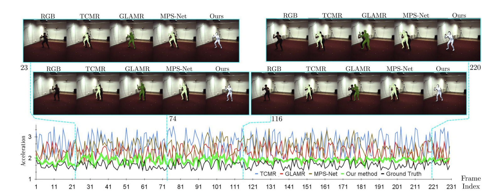
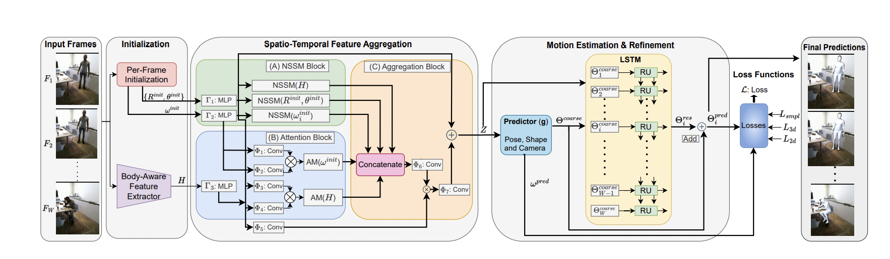

# Enhanced Spatio-Temporal Context for Temporally Consistent Robust 3D Human Motion Recovery from Monocular Videos
This page contains all the information of this project.

## About the project

This joint project is a collaboration between [TCS Research, Kolkata](https://www.tcs.com/research-and-innovation) and [IIIT Hyderabad](https://www.iiit.ac.in/), India.

Project Members - [Sushovan Chanda](https://www.researchgate.net/profile/Sushovan-Chanda/research) [(TCS Research, Kolkata)](https://www.tcs.com/research-and-innovation), [Amogh Tiwari](https://www.linkedin.com/in/amogh-tiwari-b370a856/?originalSubdomain=in) [(IIIT Hyderabad)](https://www.iiit.ac.in/), [Lokender Tiwari](https://lokender.github.io/) [(TCS Research, Kolkata)](https://www.tcs.com/research-and-innovation), [Brojeshwar Bhowmick](https://sites.google.com/view/brojeshwar/home) [(TCS Research, Kolkata)](https://www.tcs.com/research-and-innovation), [Avinash Sharma](https://researchweb.iiit.ac.in/~avinash_s/resume.html) [(IIIT Hyderabad)](https://www.iiit.ac.in/), and [Hrishav Bakul Barua](https://www.researchgate.net/profile/Hrishav-Barua)  [(TCS Research, Kolkata)](https://www.tcs.com/research-and-innovation)

###Abstract
Recovering temporally consistent 3D human body pose,
shape and motion from a monocular video is a challenging
task due to (self-)occlusions, poor lighting conditions, complex articulated body poses, depth ambiguity, and limited
availability of annotated data. Further, doing a simple perframe estimation is insufficient as it leads to jittery and implausible results. In this paper, we propose a novel method
for temporally consistent motion estimation from a monocular video. Instead of using generic ResNet-like features, our
method uses a body-aware feature representation and an independent per-frame pose and camera initialization over a
temporal window followed by a novel spatio-temporal feature aggregation by using a combination of self-similarity
and self-attention over the body-aware features and the perframe initialization. Together, they yield enhanced spatiotemporal context for every frame by considering remaining
past and future frames. These features are used to predict
the pose and shape parameters of the human body model,
which are further refined using an LSTM. Experimental results on the publicly available benchmark data show that
our method attains significantly lower acceleration error
and outperforms the existing state-of-the-art methods over
all key quantitative evaluation metrics, including complex
scenarios like partial occlusion, complex poses and even
relatively low illumination.

[Link to the paper](https://arxiv.org/pdf/2311.11662.pdf)!!

## Overview

Our method yields superior and temporally consistent motion estimation. It can be observed that our method yield graph (green
curve) significantly closer to the ground truth acceleration graph (black curve) compared to existing methods [1](https://openaccess.thecvf.com/content/CVPR2021/papers/Choi_Beyond_Static_Features_for_Temporally_Consistent_3D_Human_Pose_and_CVPR_2021_paper.pdf), [2](https://arxiv.org/abs/2203.08534), and [3](https://arxiv.org/abs/2112.01524) (result inferred on
unseen test video from [Human3.6M dataset](https://ieeexplore.ieee.org/document/6682899)).

## The Architecture

