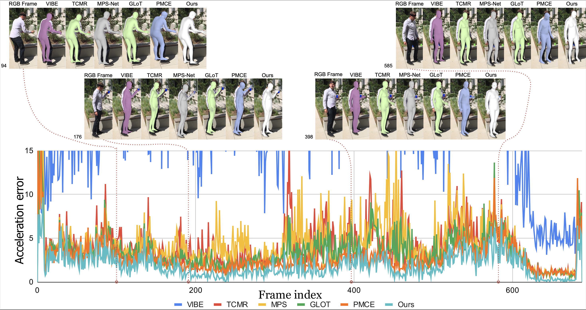
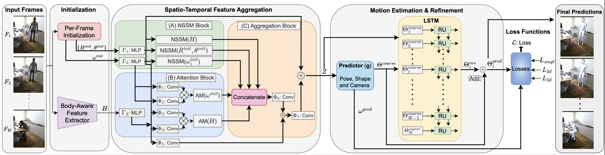

# Enhanced Spatio-Temporal Context for Temporally Consistent Robust 3D Human Motion Recovery from Monocular Videos
This page contains all the information of this project.

## About the project

This joint project is a collaboration between [TCS Research, Kolkata](https://www.tcs.com/research-and-innovation) and [IIIT Hyderabad](https://www.iiit.ac.in/), India.

Project Members - 
[Sushovan Chanda](https://www.researchgate.net/profile/Sushovan-Chanda/research) [(TCS Research, Kolkata)](https://www.tcs.com/research-and-innovation), 
[Amogh Tiwari](https://www.linkedin.com/in/amogh-tiwari-b370a856/?originalSubdomain=in) [(IIIT Hyderabad)](https://www.iiit.ac.in/), 
[Lokender Tiwari](https://lokender.github.io/) [(TCS Research, Kolkata)](https://www.tcs.com/research-and-innovation), 
[Brojeshwar Bhowmick](https://sites.google.com/view/brojeshwar/home) [(TCS Research, Kolkata)](https://www.tcs.com/research-and-innovation), 
Avinash Sharma](https://researchweb.iiit.ac.in/~avinash_s/resume.html) [(IIIT Hyderabad)](https://www.iiit.ac.in/), and
[Hrishav Bakul Barua](https://www.researchgate.net/profile/Hrishav-Barua)  [(TCS Research, Kolkata)](https://www.tcs.com/research-and-innovation)&[Monash University, Melbourne, Australia](https://www.monash.edu/)

### Abstract

[Link to the paper](https://arxiv.org/pdf/2311.11662.pdf)!!

## Overview

Our method yields superior and temporally consistent motion estimation. It can be observed that our method yield graph (green
curve) significantly closer to the ground truth acceleration graph (black curve) compared to existing methods [1](https://openaccess.thecvf.com/content/CVPR2021/papers/Choi_Beyond_Static_Features_for_Temporally_Consistent_3D_Human_Pose_and_CVPR_2021_paper.pdf), [2](https://arxiv.org/abs/2203.08534), and [3](https://arxiv.org/abs/2112.01524) (result inferred on
unseen test video from [Human3.6M dataset](https://ieeexplore.ieee.org/document/6682899)).

## The Architecture

## Videos of our work

https://github.com/HrishavBakulBarua/3D-Human/assets/111484665/5c799d6a-0346-459c-aae7-e0e4765c0b05

https://github.com/HrishavBakulBarua/3D-Human/assets/111484665/c11f1a1e-3eff-455a-9058-ffb35cfcf6aa

##  Citation 

If you find our work in your research or development activities, please cite our paper as follows:

~~~

@article{chanda2023enhanced,
  title={Enhanced Spatio-Temporal Context for Temporally Consistent Robust 3D Human Motion Recovery from Monocular Videos},
  author={Chanda, Sushovan and Tiwari, Amogh and Tiwari, Lokender and Bhowmick, Brojeshwar and Sharma, Avinash and Barua, Hrishav},
  journal={arXiv preprint arXiv:2311.11662},
  year={2023}
}

~~~
